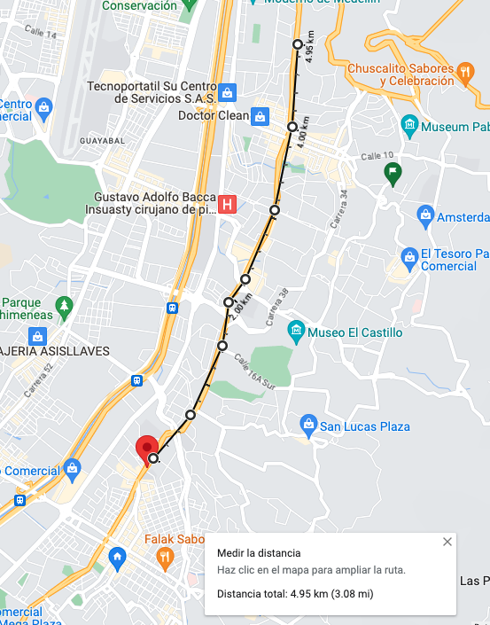
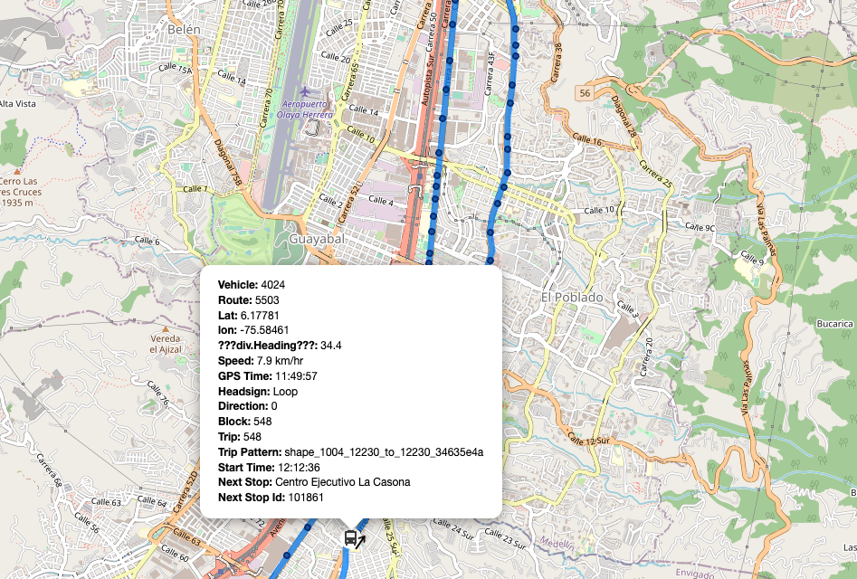
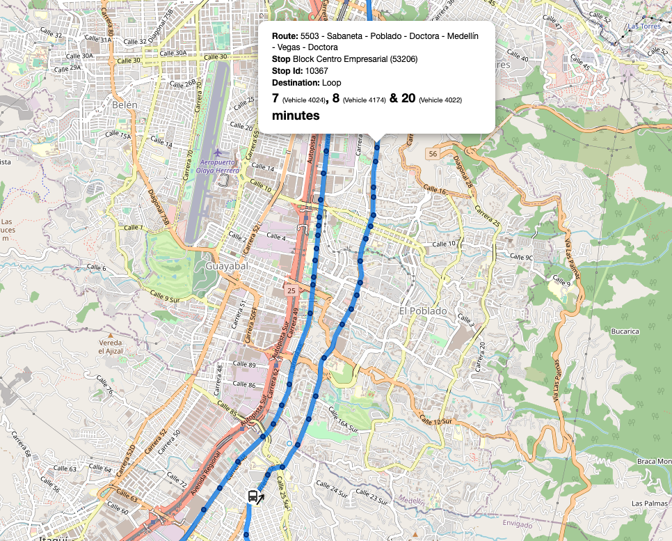

# TransitClock Muuf

## Problemas:
El calculo de estimación de llegadas no da los tiempo esperados.

### Ejemplos

### 1. Tramo de referencia



Tenemos un tramo de 5km (aprox) con un vehículo en velocidad promedio de 8km según un calculo de velocidad sobre distancia el tiempo estimado de llegada, debería estar por encima de 37 minutos. 

### 2. Bus de referencia


### 3. Predicción de llegada

Para el paradero en cuestión podemos ver ver que dice tiempo estimada de llegada 7 minutos.

## Ambiente de ejecución
Partiendo del proyecto [TransitTimeDocker](https://github.com/TheTransitClock/transitclockDocker) tenemos una instancia por cada agencia para pruebas corriendo en un contenedor de Docker con la version [untagged-d6fe7b2bebe82bd22e90](https://github.com/TheTransitClock/transitime/releases/tag/untagged-d6fe7b2bebe82bd22e90) del TransitTime.

## Datos de origen:

Estos son los datos que usamos para alimentar la instancia.

- [GTFS Estático de la empresa SOTRAMES](https://s3.sonartelematics.com/muuf/gtfs/gtfs_sotrames.zip)

- GTFS-RT Buffer

```json
{
	"header": {
		"gtfsRealtimeVersion": "2.0",
		"incrementality": "FULL_DATASET",
		"timestamp": "1686692479512"
	},
	"entity": [
		{
			"id": "3828",
			"vehicle": {
				"trip": {
					"tripId": "455",
					"startDate": "20230613",
					"routeId": "468"
				},
				"position": {
					"latitude": 6.1816182136535645,
					"longitude": -75.58113861083984,
					"bearing": 254,
					"speed": 3.8888888359069824
				},
				"timestamp": "1686692457000",
				"vehicle": {
					"id": "3828",
					"label": "EXU987",
					"licensePlate": "EXU987"
				}
			}
		},
		...[Todos los vehiculos reportados en esa agencia]
	]
}
```

### TransitClock Config file
El archivo de configuracion para la esta agencia:

```properties
transitclock.autoBlockAssigner.autoAssignerEnabled=false
transitclock.autoBlockAssigner.ignoreAvlAssignments=false
transitclock.autoBlockAssigner.allowableEarlySeconds=1200
transitclock.autoBlockAssigner.allowableLateSeconds=1200

transitclock.avl.feedTimeoutInMSecs=30000
transitclock.avl.gtfsRealtimeFeedURI=GTFSRTVEHICLEPOSITIONS
transitclock.avl.maxSpeed=10
transitclock.avl.numThreads=1
transitclock.avl.queueSize=2400
transitclock.avl.minLatitude=4

transitclock.blockLoading.agressive=false

transitclock.cache.core.daysPopulateHistoricalCache=0

transitclock.core.agencyId=AGENCYID
transitclock.core.allowableEarlyDepartureTimeForLoggingEvent=180
transitclock.core.allowableEarlyForLayoverSeconds=1800
transitclock.core.allowableEarlySecondsForInitialMatching=1200
transitclock.core.allowableEarlyTimeForEarlyDepartureSecs=180
transitclock.core.allowableLateAtTerminalForLoggingEvent=240
transitclock.core.allowableLateDepartureTimeForLoggingEvent=360
transitclock.core.allowableLateSeconds=2700
transitclock.core.allowableNumberOfBadMatches=4
transitclock.core.afterStopDistance=1
transitclock.core.beforeStopDistance=1
transitclock.core.cache.tripDataHistoryCache=org.transitclock.core.dataCache.ehcache.scheduled.TripDataHistoryCache
transitclock.core.cache.errorCacheClass=org.transitclock.core.dataCache.ehcache.KalmanErrorCache
transitclock.core.cache.stopArrivalDepartureCache=org.transitclock.core.dataCache.ehcache.StopArrivalDepartureCache
# transitclock.core.cache.stopPathPredictionCache=org.transitclock.core.dataCache.StopPathPredictionCache
transitclock.core.cache.stopPathPredictionCache=org.transitclock.core.dataCache.ehcache.dummy.DummyStopPathPredictionCache
# transitclock.core.cache.dwellTimeModelCache=org.transitclock.core.dataCache.ehcache.scheduled.DwellTimeModelCache
transitclock.core.cache.dwellTimeModelCache=org.transitclock.core.dataCache.ehcache.dummy.DummyDwellTimeModelCache
transitclock.core.distanceFromLayoverForEarlyDeparture=250
transitclock.core.dwelltime.model=org.transitclock.core.predictiongenerator.scheduled.dwell.DwellAverage
transitclock.core.dwelltime.headwayGeneratorClass=org.transitclock.core.headwaygenerator.LastArrivalsHeadwayGenerator
transitclock.core.exclusiveBlockAssignments=false
transitclock.core.fillHistoricalCaches=0
transitclock.core.layoverDistance=1000
transitclock.core.longDistanceDeadheadingSpeed=20
transitclock.core.matchHistoryMaxSize=40
transitclock.core.maxHeadingOffsetFromSegment=200
transitclock.core.maxPredictionTimeForDbSecs=1200
transitclock.core.maxPredictionsTimeSecs=7200
transitclock.core.minDistanceForDelayed=100
transitclock.core.minDistanceForNoProgress=100
transitclock.core.onlyNeedArrivalDepartures=false
transitclock.core.predictionGeneratorClass=org.transitclock.core.predictiongenerator.scheduled.traveltime.kalman.KalmanPredictionGeneratorImpl
transitclock.core.shortDistanceDeadheadingSpeed=10
transitclock.core.timeForDeterminingDelayedSecs=300
transitclock.core.timeForDeterminingNoProgress=360000
transitclock.core.trackHistoricalCaches=true
transitclock.core.useArrivalPredictionsForNormalStops=true

transitclock.db.batchSize=4000
transitclock.db.dbName=AGENCYNAME
transitclock.db.dbPassword=DB_PASS
transitclock.db.dbUserName=DB_USER
transitclock.db.dbHost=DB_HOST:DB_PORT
transitclock.db.storeDataInDatabase=true
transitclock.db.dbType=mysql


transitclock.predAccuracy.stopsPerTrip=1000
transitclock.predAccuracy.maxPredTimeMinutes=30

transitclock.prediction.data.kalman.mindays=3
transitclock.prediction.data.kalman.maxdays=5
transitclock.prediction.data.kalman.maxdaystosearch=21
transitclock.prediction.data.kalman.percentagePredictionMethodDifferencene=50
transitclock.prediction.data.kalman.tresholdForDifferenceEventLog=60000
transitclock.prediction.rls.lambda=0.9

transitclock.timeout.pollingRateSecs=60

transitclock.hibernate.configFile=/usr/local/transitclock/config/hibernate.cfg.xml
transitclock.logging.dir=/usr/local/transitclock/logs
transitclock.modules.optionalModulesList=org.transitclock.avl.GtfsRealtimeModule;org.transitclock.core.predAccuracy.PredictionAccuracyModule
transitclock.web.mapTileUrl=http://tile.openstreetmap.org/{z}/{x}/{y}.png


```
